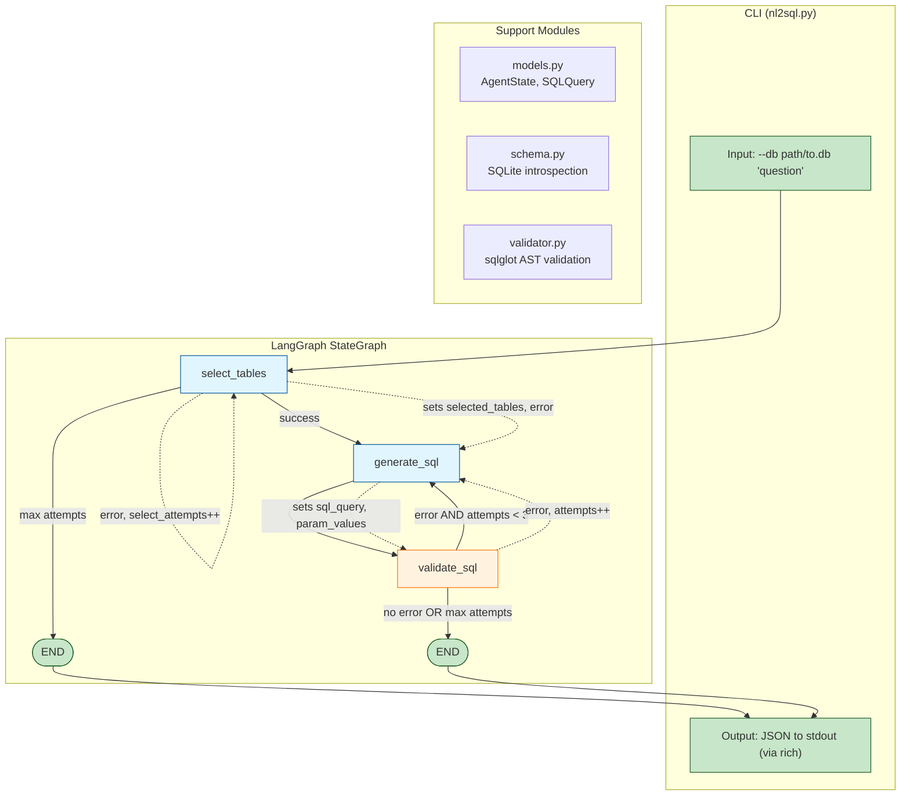
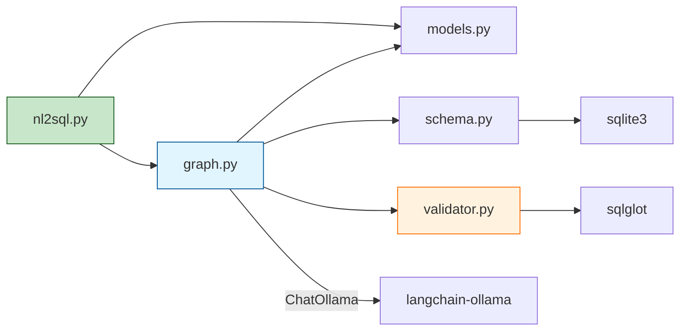
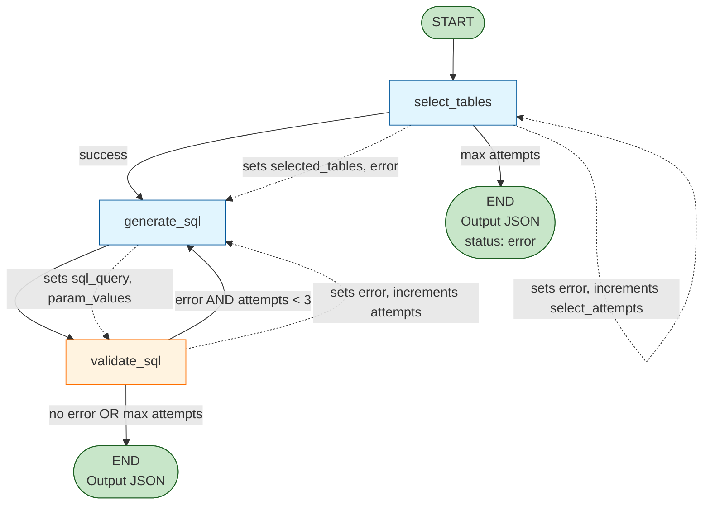
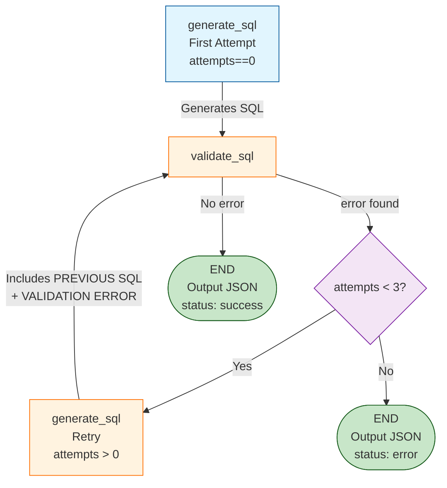

# NL2SQL Agent - Design Document

## 1. Project Overview
AI agent that converts natural language instructions to SQLite SQL queries. Returns structured JSON output with SQL and parameterized values. No query execution (generation-only MVP).

**Example Input:**
> "Get the total revenue for Adventure Works Cycles. Include the contact information as well."

**Success Output:**
```json
{
    "sql": "SELECT c.company, c.city, c.email, SUM(o.total) AS revenue FROM customers c INNER JOIN orders o ON c.id = o.customer_id WHERE c.company = ? GROUP BY c.company, c.city, c.email",
    "param_values": ["Adventure Works Cycles"],
    "status": "success"
}
```

**Failure Output (Max Attempts Exceeded):**
```json
{
    "sql": "SELECT c.company FROM customers WHERE c.company = ?",
    "param_values": ["Adventure Works Cycles"],
    "status": "error",
    "error": "Validation failed after 3 attempts. Last error: Unauthorized table: orders"
}
```

**Failure Output (select_tables Max Attempts):**
```json
{
    "sql": "",
    "param_values": [],
    "status": "error",
    "error": "Validation failed after 2 attempts. Last error: Invalid JSON response from table selection"
}
```

---

## 2. Core Design Decisions

| Decision | Choice | Rationale |
|----------|--------|-----------|
| LLM Provider | Local open-source (Ollama) | Zero API cost, 100% data privacy, no external API keys needed |
| Local Model | `phi4-mini-reasoning:latest` (default) | Microsoft Phi-4 Mini Reasoning (3.8B, 128K context). Supports JSON mode via `format="json"`. Strong reasoning capabilities for SQL generation. |
| SQL Dialect | SQLite | Lightweight, serverless, stdlib `sqlite3` support |
| Agent Scope | Generation-only | MVP returns JSON only; no query execution against DB |
| Param Style | SQLite `?` placeholders | Matches SQLite dialect; positional param values in `param_values` |
| Schema Input | Read from SQLite file | Auto-introspect via `sqlite3` PRAGMA commands; zero config for users |
| Schema Scope | Two-step LLM (table selection first) | LangGraph node 1: select relevant tables; node 2: generate SQL with narrowed schema. Improves accuracy for larger schemas |
| SQL Validation | 5-step `sqlglot` AST pipeline | (1) Syntax (2) Security/SELECT-only (3) Allowlist tables/columns (4) Param count check (5) Literal check (reject hardcoded values) |
| Orchestration | LangGraph `StateGraph` | Stateful multi-step workflow with conditional retry edges |
| LLM Integration | `langchain-ollama` | Native Ollama support via LangChain ecosystem, no OpenAI SDK workaround |
| Observability | LangSmith | Zero-config tracing of all LangGraph nodes, LLM calls, retries |
| Interface | CLI only (`argparse` + `rich`) | MVP targets shell usage; pipe-friendly JSON output to stdout |
| Retry Logic | Two retry counters: `select_attempts` (max 2) for table selection, `attempts` (max 3) for SQL generation | **select_tables**: Retries on parse failure with incremented `select_attempts` (max 2). **generate_sql**: Two-branch prompt - first attempt clean; retries include Previous SQL + Validation Error |
| State Tracking | Two counter fields: `select_attempts` + `attempts` | Separate retry tracking for table selection vs SQL generation with independent max attempts |
| Configuration | CLI args + env vars + `.env` | `--db` required CLI arg; `OLLAMA_BASE_URL`, `OLLAMA_MODEL` via env/.env |

---

## 3. Tech Stack

### Dependencies (`pyproject.toml`)
```
# Core LLM + Orchestration
langchain>=1.2.0
langchain-ollama>=0.1.0
langgraph>=1.0.0
langsmith>=0.1.0

# Data + Validation
pydantic>=2.0
sqlglot>=25.0

# Config + CLI
python-dotenv>=1.0
rich>=13.0
```

### Tools
- **`uv`**: Package management, Python version (≥3.11)
- **`ruff`**: Linting + formatting (≥0.15.12)
- **`mypy`**: Static type checking (≥1.20.2)
- **Ollama**: Local LLM runtime (serves API at `http://localhost:11434`)
- **`phi4-mini-reasoning:latest`**: Microsoft Phi-4 Mini Reasoning (3.8B, 128K context window). Supports JSON mode via `format="json"`

---

## 4. System Architecture

### High-Level Architecture (Mermaid)



### Module Dependency Flow



---

## 5. LangGraph Workflow

### Agent State (Custom TypedDict)
```python
from typing import TypedDict

class AgentState(TypedDict):
    # Input fields (set in initial state)
    question: str
    db_schema: str
    # Retry/error tracking for select_tables
    select_attempts: int
    # Retry/error tracking for generate_sql
    attempts: int
    # Node-populated fields (initialized as None in initial state)
    selected_tables: list[str] | None
    sql_query: str | None
    param_values: list[str] | None
    error: str | None  # None if no error, else validation error message
```

**Initialization Rules:**
- `question` and `db_schema` are provided in the initial graph state
- `select_attempts` is explicitly initialized to `0` in the initial state (tracks `select_tables` retries)
- `attempts` is explicitly initialized to `0` in the initial state (tracks `generate_sql` retries)
- `selected_tables`, `sql_query`, `param_values`, and `error` are initialized as `None` in the initial state (populated by nodes during workflow execution)

### SQLQuery Pydantic Model
Used to parse and validate LLM responses from `generate_sql` node:

```python
from pydantic import BaseModel, ConfigDict, field_validator

class SQLQuery(BaseModel):
    model_config = ConfigDict(extra='forbid')  # Reject unexpected keys from LLM
    
    sql: str
    param_values: list[str]
    
    @field_validator('sql')
    @classmethod
    def sql_must_not_be_empty(cls, v: str) -> str:
        if not v.strip():
            raise ValueError('sql must not be empty')
        return v
```

### 5.1 Schema Format (schema.py output)
The schema string passed to LLM prompts (`{schema}` for full schema, `{schema_narrowed}` for selected tables) uses a table-per-line format with explicit foreign key syntax:

```
table_name (column1 TYPE, column2 TYPE, PRIMARY KEY (col), FOREIGN KEY (col) REFERENCES other_table(col))

Example:
customers (id INTEGER PRIMARY KEY, company TEXT NOT NULL, city TEXT, email TEXT)
orders (id INTEGER PRIMARY KEY, customer_id INTEGER NOT NULL, total REAL, FOREIGN KEY (customer_id) REFERENCES customers(id))
order_items (id INTEGER PRIMARY KEY, order_id INTEGER NOT NULL, product_id INTEGER NOT NULL, quantity INTEGER, FOREIGN KEY (order_id) REFERENCES orders(id), FOREIGN KEY (product_id) REFERENCES products(id))
```

This format is LLM-friendly, explicit about types/constraints, and matches SQLite's PRAGMA introspection output when formatted correctly.

### Output Behavior
The agent outputs JSON to stdout via `rich`. The output structure depends on success/failure:

**Success (no error, validation passed):**
```json
{
    "sql": "SELECT ...",
    "param_values": [...],
    "status": "success"
}
```

**Failure (max attempts exceeded or unrecoverable error):**
```json
{
    "sql": "SELECT ...",  // Last generated SQL (may be invalid)
    "param_values": [...],  // Last generated parameters
    "status": "error",
    "error": "Validation failed after 3 attempts. Last error: Unauthorized table: xyz"
}
```

**Key:** 
- Success always includes `"status": "success"` with `"sql"` and `"param_values"`
- Failure includes `"status": "error"` with `"error"` field containing validation context
- Programmatic checking: if `status == "error"`, the SQL may be invalid
- `"attempts"` field is internal only, not exposed in output (3 on generate_sql failure, 2 on select_tables failure)

### Nodes
1. **`select_tables`**: LLM (ChatOllama with `phi4-mini-reasoning:latest`) reviews full schema, returns list of relevant tables for the question
   - Uses `ChatOllama(format="json")` for JSON mode output
   - **LLM Response Parsing**: Parse response with `json.loads()`, validate:
     - Must be a list of strings
     - List must not be empty
     - All table names must exist in the full schema
   - **Retry Logic**: Max 2 attempts (`select_attempts`). On failure, increment `select_attempts`, set `error` with details. If `select_attempts >= 2`, route to END with error status.
   - On success: set `selected_tables` in state, clear `error`

2. **`generate_sql`**: LLM generates SQL with `?` placeholders + `param_values` using narrowed schema (only selected tables)
   - **First attempt** (`attempts == 0`): Clean prompt with schema + question + few-shot JSON example
   - **Retry** (`attempts > 0`): Augmented prompt includes:
     - `PREVIOUS SQL: {sql_query}`
     - `VALIDATION ERROR: {error}`
     - `INSTRUCTION: Fix the SQL above based on the validation error and regenerate`
   - Uses `ChatOllama(format="json")` for JSON mode output
   - **LLM Response Parsing**: Use `SQLQuery.model_validate_json(llm_response.content)` to parse and validate output (checks for `sql` and `param_values` keys, rejects extra keys, ensures `sql` is non-empty)
   - On parse failure: increment `attempts`, set `error` to parse error details, loop back if `attempts < 3`
   - On success: set `sql_query`, `param_values` in state, clear `error`
   - Includes few-shot example (Adventure Works example from Section 1):

   **Few-Shot Example (must match output format exactly):**
   ```json
   {
       "sql": "SELECT c.company, c.city, c.email, SUM(o.total) AS revenue FROM customers c INNER JOIN orders o ON c.id = o.customer_id WHERE c.company = ? GROUP BY c.company, c.city, c.email",
       "param_values": ["Adventure Works Cycles"]
   }
   ```

3. **`validate_sql`**: Runs `sqlglot.parse_one()` + AST allowlist walk; sets `error` with details if validation fails

### LangGraph Flow Diagram (Mermaid)



**Diagram Notes:**
- Blue nodes: LLM-powered (select_tables, generate_sql)
- Orange node: Validation (validate_sql)
- Green: Start/End points
- Dashed lines: State updates passed between nodes
- Conditional edges:
  - `select_tables` loops back to itself if error exists AND `select_attempts < 2`
  - `validate_sql` loops back to `generate_sql` only if error exists AND `attempts < 3`
  - `select_tables` routes to END with error if max attempts (2) reached

### Edges
- `START` → `select_tables`
- `select_tables` → `select_tables` (if error and `select_attempts < 2`)
- `select_tables` → `generate_sql` (if success)
- `select_tables` → `END` (if max `select_attempts` reached)
- `generate_sql` → `validate_sql`
- `validate_sql` → `generate_sql` (if error and `attempts < 3`)
- `validate_sql` → `END` (if no error or max attempts reached)

### END Behavior (Output to CLI)
When the graph reaches `END`:

1. **Success path** (no error, validation passed):
   ```json
   {
       "sql": "SELECT ...",
       "param_values": [...],
       "status": "success"
   }
   ```

2. **Failure path** (max attempts reached with error):
   ```json
   {
       "sql": "SELECT ...",  // Last generated SQL (may be invalid)
       "param_values": [...],
       "status": "error",
       "error": "Validation failed after 3 attempts. Last error: Unauthorized table: xyz"
   }
   ```

**Key:** Both outputs include `"sql"` and `"param_values"`. Success has `"status": "success"`, failure has `"status": "error"` with `"error"` field. The `"attempts"` field is internal only, not exposed in output.

---

## 6. Module Structure (Flat Files)

| File | Responsibility |
|------|---------------|
| `models.py` | `SQLQuery` Pydantic model + `AgentState` TypedDict definition |
| `schema.py` | SQLite schema introspection via `sqlite3` PRAGMA (tables, columns, types, foreign keys) |
| `graph.py` | LangGraph `StateGraph` setup: nodes, edges, conditional retry logic |
| `validator.py` | SQL validation: `sqlglot.parse_one()` for syntax, AST walk for table/column allowlist |
| `nl2sql.py` | CLI entry point: `argparse` for `--db`/`--verbose`, `rich` for JSON output |

---

## 7. SQL Validation Pipeline

1. **Syntax Check**: `sqlglot.parse_one(sql, dialect="sqlite")` — raises if invalid SQLite syntax
2. **Security Check**: Verify AST contains only `SELECT` statements; reject `INSERT/UPDATE/DELETE/DROP/ALTER/CREATE/TRUNCATE`
3. **Allowlist Check**: Walk AST to extract all `Table` and `Column` references; verify each exists in the introspected schema
4. **Param Check**: Verify `?` placeholder count matches `param_values` length
5. **Literal Check**: Walk AST to extract all `exp.Literal` nodes; reject if any exist (all literal values must be replaced with `?` placeholders per SPEC rules)

If any check fails: increment `attempts`, set `error` with details (e.g., "Unauthorized table: xyz", "Syntax error: ...", "Hardcoded literal found: 'value'"), return to `generate_sql` node (max 3).

### Error Feedback Cycle (Critical for Self-Correction)
The `generate_sql` node **must** check if `error` is set in state. If present, it incorporates the error into the LLM prompt:

**First Attempt (`attempts == 0`):**
```
System: You are an expert SQLite SQL generator.
Schema: [narrowed tables with columns + types + foreign keys]
Rules: SELECT-only, use ? placeholders for literals, no SELECT *, explicit GROUP BY
Output Format: Return ONLY valid JSON with keys: "sql" and "param_values"
Example:
{
    "sql": "SELECT ...",
    "param_values": [...]
}
Question: {question}
```

**Retry (`attempts > 0`):**
```
[Same system prompt as above]
PREVIOUS SQL: {sql_query}
VALIDATION ERROR: {error}
INSTRUCTION: Fix the SQL above based on the validation error and regenerate.
Question: {question}
```

Without this feedback loop, retries are "just a coin flip" — the LLM has no information about what went wrong (source: machinelearningplus, 2026).

### Error Feedback Flow (Mermaid)



**Key:** The retry path (orange) includes error context in the prompt, allowing the LLM to "see what broke and aim its fix" (machinelearningplus, 2026). When max attempts are reached, the output includes `status: "error"` with the `error` field containing validation context.

### sqlglot Usage in `validator.py`
sqlglot is the cornerstone of SQL validation. It parses SQL into an Abstract Syntax Tree (AST) for structural analysis:

1. **Syntax Check**: `ast = sqlglot.parse_one(sql, dialect="sqlite")` — raises `sqlglot.errors.ParseError` if invalid
2. **Extract Tables**: `tables = {t.name for t in ast.find_all(exp.Table)}` — get all table references
3. **Extract Columns**: `columns = {c.name for c in ast.find_all(exp.Column)}` — get all column references
4. **Security Check**: `isinstance(ast, exp.Select)` + walk AST to reject `exp.Insert`, `exp.Update`, `exp.Delete`, etc.
5. **Allowlist Verification**: Compare extracted tables/columns against introspected schema

Example:
```python
import sqlglot
import sqlglot.expressions as exp

sql = "SELECT c.company FROM customers c WHERE c.company = ?"
ast = sqlglot.parse_one(sql, dialect="sqlite")

# Extract references
tables = {t.name for t in ast.find_all(exp.Table)}  # {'customers'}
columns = {c.name for c in ast.find_all(exp.Column)}  # {'company'}
```

---

## 8. Configuration

### CLI Arguments
- `--db` (required): Path to SQLite `.db` file
- `--verbose` (optional): Print debug info (prompts, raw LLM responses, validation steps)

### Environment Variables (`.env` supported via `python-dotenv`)
| Variable | Default | Description |
|----------|---------|-------------|
| `OLLAMA_BASE_URL` | `http://localhost:11434` | Ollama API endpoint |
| `OLLAMA_MODEL` | `phi4-mini-reasoning:latest` | Ollama model (Microsoft Phi-4 Mini Reasoning, 3.8B) |
| `LANGCHAIN_TRACING_V2` | `false` | Enable LangSmith tracing |
| `LANGCHAIN_API_KEY` | (none) | LangSmith API key |
| `LANGCHAIN_PROJECT` | `nl2sql-dev` | LangSmith project name |

---

## 9. LangSmith Observability

Zero-config setup: set `LANGCHAIN_TRACING_V2=true` + `LANGCHAIN_API_KEY`, and all LangGraph nodes, LLM calls, tool invocations, and retries are automatically traced in the LangSmith dashboard.

**Traced Elements:**
- Full LangGraph state transitions
- LLM prompts and responses for both table selection and SQL generation
- SQL validation steps and error messages
- Retry attempts and final output

No code changes required — LangChain/LangGraph auto-integrate with LangSmith via env vars.

---

## 10. CLI Usage

### Basic Usage
```bash
uv run nl2sql --db chinook.db "Get the total revenue for Adventure Works Cycles"
```

### Success Output
```json
{
    "sql": "SELECT c.company, c.city, c.email, SUM(o.total) AS revenue FROM customers c INNER JOIN orders o ON c.id = o.customer_id WHERE c.company = ? GROUP BY c.company, c.city, c.email",
    "param_values": ["Adventure Works Cycles"],
    "status": "success"
}
```

### Failure Output (Max Attempts Exceeded - generate_sql)
```json
{
    "sql": "SELECT c.company FROM customers WHERE c.company = ?",
    "param_values": ["Adventure Works Cycles"],
    "status": "error",
    "error": "Validation failed after 3 attempts. Last error: Unauthorized table: orders"
}
```

### Failure Output (Max Attempts Exceeded - select_tables)
```json
{
    "sql": "",
    "param_values": [],
    "status": "error",
    "error": "Validation failed after 2 attempts. Last error: Invalid JSON response from table selection"
}
```

**Note:** 
- Success includes `"status": "success"` with the generated SQL and parameters
- Failure includes `"status": "error"` with `"error"` field containing validation context
- The `sql` field may contain invalid SQL on failure (last generated)
- `"attempts"` field is internal only, not exposed in output (3 on generate_sql failure, 2 on select_tables failure)

### Verbose Mode
```bash
uv run nl2sql --db chinook.db --verbose "Show all customers from Germany"
```

### LangSmith Tracing
```bash
export LANGCHAIN_TRACING_V2=true
export LANGCHAIN_API_KEY=ls__your_key_here
export LANGCHAIN_PROJECT=nl2sql-dev
uv run nl2sql --db chinook.db "Your question here"
```

---

## 11. Prompt Design

### `select_tables` Prompt
```
System: You are an expert at analyzing database schemas.
Given a question and full database schema, identify the minimum set of tables needed to answer the question.

Schema:
{schema}

Question: {question}

Return ONLY a JSON array of table names, e.g., ["customers", "orders"]
```

### `generate_sql` Prompt — First Attempt (`attempts == 0`)
```
System: You are an expert SQLite SQL generator.

Schema (selected tables only):
{schema_narrowed}

Rules:
- SELECT statements only (no INSERT/UPDATE/DELETE/DROP/ALTER/CREATE/TRUNCATE)
- Use ? placeholders for literal values in the question
- Build param_values array with the literal values in order
- No SELECT * — only select needed columns
- Use explicit GROUP BY when using aggregate functions
- Use table aliases for readability

Output Format: Return ONLY valid JSON with keys: "sql" and "param_values"
Example:
Question: "Get the total revenue for Adventure Works Cycles. Include the contact information."
{
    "sql": "SELECT c.company, c.city, c.email, SUM(o.total) AS revenue FROM customers c INNER JOIN orders o ON c.id = o.customer_id WHERE c.company = ? GROUP BY c.company, c.city, c.email",
    "param_values": ["Adventure Works Cycles"]
}

Question: {question}
```

### `generate_sql` Prompt — Retry (`attempts > 0`)
```
[Same system prompt as above]

PREVIOUS SQL: {sql_query}
VALIDATION ERROR: {error}
INSTRUCTION: Fix the SQL above based on the validation error and regenerate.

Question: {question}
```

**Key Principle**: The error feedback loop is critical — without it, retries are "just a coin flip" (machinelearningplus, 2026). The LLM must see what failed to aim its fix.

---

## 12. MVP Scope & Exclusions

**In Scope:**
- SQLite schema introspection
- Two-step LLM table selection → SQL generation
- `sqlglot`-based strict validation with retry
- LangGraph orchestration
- LangSmith tracing
- CLI with JSON output

**Out of Scope (Future Work):**
- SQL execution against database
- Multi-dialect support (Postgres, MySQL)
- Embedding-based table selection (vector search)
- HTTP API (FastAPI)
- Interactive multi-turn conversations
- Fine-tuned small models for table selection/SQL generation
